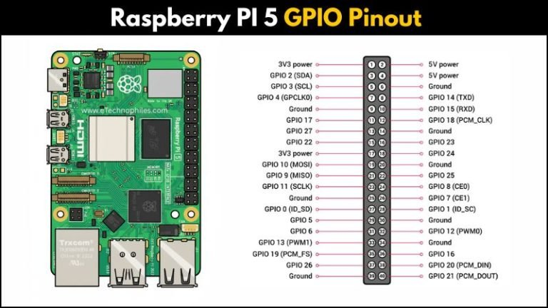

# rpi5-ButtonPressInterrupt

One Side of the Push Button is connected to line GPIO17
The line is kept high through a resistor connected to Onboard 3.3V
The other side of the Push Button is connected to GND
When the puss button is pressed the GPIO17 fall down to GND

The python script is configured to:
1)
2)
3) 